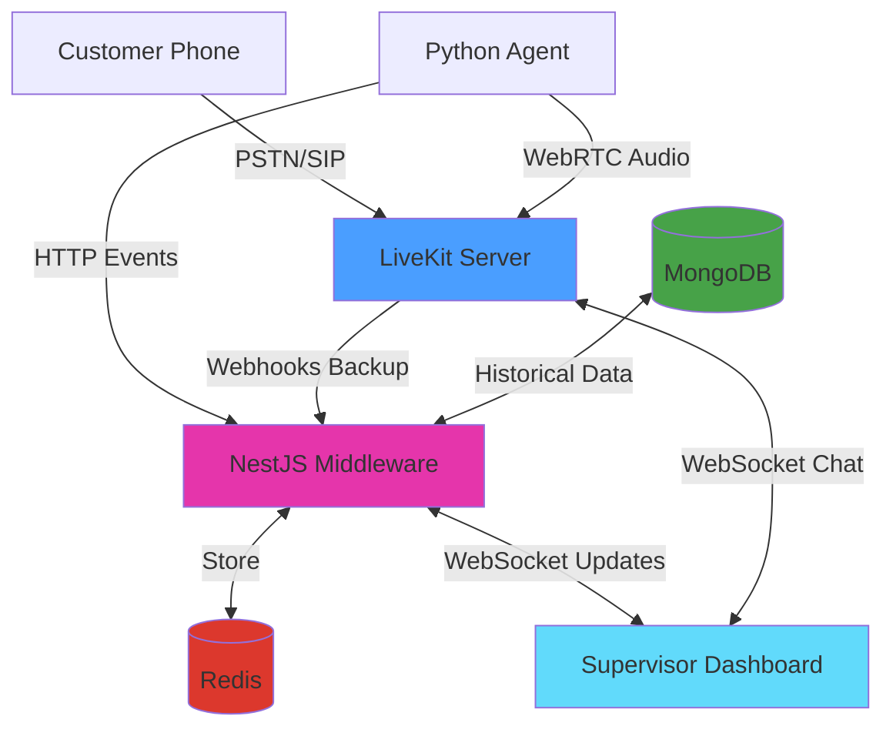
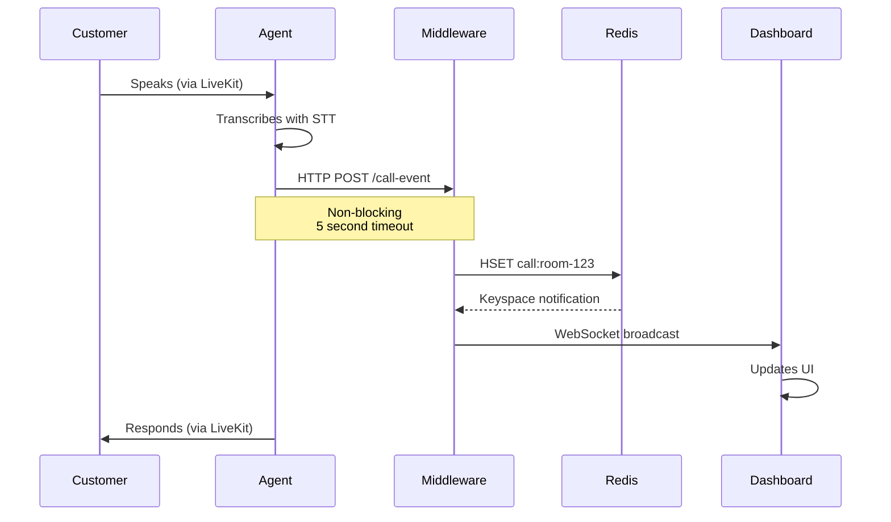
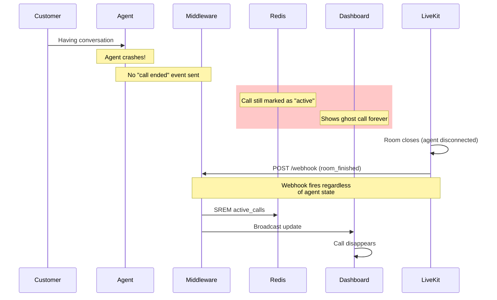
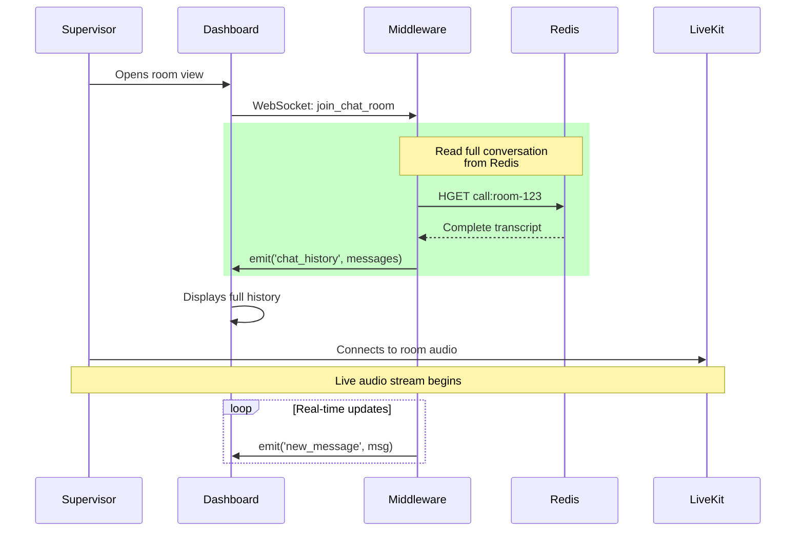

> [!ABSTRACT] TL;DR
> Built a real-time monitoring dashboard for AI voice agents using LiveKit's participant model. Supervisors join calls as regular participants, middleware handles state sync via Redis, and webhook fallbacks prevent ghost calls. Four days from concept to production.

I had a voice agent working in production. Nothing fancy - the usual STT → LLM → TTS pipeline that everyone's building these days. (I'll write about that setup in a separate post, but honestly, if you've seen one voice agent architecture, you've seen them all.)

The agent was handling calls just fine. Natural-sounding voice, could hold a conversation, didn't embarrass itself too often. We had the whole testing setup too - datasets covering different scenarios, LLM-as-judge evals in Langfuse, post-call transcript analysis, the works.

But here's the thing: all of that happens after the call.

What if the AI completely misunderstands someone right now? What if a customer is getting frustrated this second? What if they need a human and we're making them sit through three more minutes of the AI trying to help?

Sure, we'd see it in the post-call analytics. We'd adjust our prompts, add it to the test suite, prevent it from happening to the next customer. Great for iteration. Terrible for the person on the phone right now who's about to hang up and never call back.

That seemed bad.

So I started digging through LiveKit's documentation looking for some monitoring API, maybe a way to tap into calls and observe them live. I was mentally preparing to build some complex system that hooks into media streams from the outside when I realized something.

I stared at the LiveKit architecture. Here's how LiveKit actually works: there are "rooms" - realtime sessions where participants connect. A participant can be a user, an agent, or basically anything that needs to send or receive audio/video/data. Each participant can publish tracks (audio, video) and subscribe to tracks from other participants.

When a call happens in our system:

- Customer joins the room as a participant, publishes their audio
- AI agent joins the room as a participant, subscribes to customer audio, publishes its own audio back
- They talk via WebRTC

What if supervisors could just... join the room too? As another participant?

Not as some special observer with a complicated monitoring system watching from outside. Just join. Like the third person on a conference call. They could subscribe to both the customer's and agent's audio tracks to listen. They could publish their own audio track to speak. They could mute the agent's track entirely to take over.

The platform already had everything we needed. We just had to use it differently.

---
## What I Built

I built two things over four days: a real-time supervisor dashboard where you can monitor and intervene in AI phone calls, and the backend infrastructure that makes it work.

The dashboard is what supervisors actually see and use. The backend is what solves the hard problems - conversation history, ghost call prevention, and real-time synchronization.
I built two different views because, honestly, I wasn't sure which one would actually be useful in practice.

> [!TIP]
> I used [LiveKit's Next.js starter](https://github.com/livekit-examples/agent-starter-react) as the foundation.

**Bubble View**

This one looks a bit ridiculous but I think it's cool. Calls appear as glowing bubbles floating in a hexagonal grid. When someone's speaking, their bubble pulses. Happy customers are green, frustrated ones are red.

The inspiration came from the Apple Watch - how do you pack maximum information into minimal space? I thought: why not apply that to call monitoring? Instead of boring rows of data, make each call a living, breathing bubble that tells you everything at a glance.

Here's the clever bit: negative sentiment calls automatically drift toward the center of the screen. So when you've got 10+ calls happening at once, the ones that need attention are literally harder to miss.



I had few days, a motion animation library, and free will. This is what happened.

**How it actually works:**

The bubble positioning isn't random - it uses a hexagonal packing algorithm. Think honeycomb. I wrote a function that calculates positions in concentric rings:
- Center position (layer 0): 1 bubble
- First ring (layer 1): 6 bubbles in a perfect hexagon
- Second ring (layer 2): 12 bubbles
- Each subsequent ring adds 6 more positions

```typescript
// Simplified version of the algorithm
function getHexagonalRingPositions(layer, radius, centerX, centerY) {
  if (layer === 0) return [{ x: centerX, y: centerY }];
  const distance = radius * layer * 1.2;
  const positions = [];
  if (layer === 1) {
    // First ring: 6 positions at 60-degree intervals
    for (let i = 0; i < 6; i++) {
      const angle = (i * Math.PI) / 3;
      positions.push({
        x: centerX + Math.cos(angle) * distance,
        y: centerY + Math.sin(angle) * distance
    ..... More
  
  return positions;
}
```

Priority placement happens before positioning. Calls get sorted by sentiment - negative sentiment gets priority 0 (highest), neutral gets 1, positive gets 2 (lowest). Then they fill positions from center outward. So when someone's frustrated, their bubble ends up in the inner rings automatically. No manual intervention needed.

The bubbles themselves are built with Framer Motion for the animations and a custom particle system (tsparticles) for the sparkle effects. Each bubble's particle density and speed changes based on the agent's state - more particles when thinking, faster when speaking. It's completely unnecessary but it makes the state visible at a glance.

**Card View**

Sometimes you just want a normal grid. This shows all the important details at a glance - who's on the call, how long they've been talking, current sentiment, that sort of thing.



**Room View**

Click any call and you're in. This is where the magic happens.



You get:
- Live transcript of everything being said (this updates as people speak, it's surprisingly satisfying to watch)
- Audio controls to listen, speak, or take over
- Debug panel showing what the AI is actually doing under the hood
- Connection stats because sometimes you need to know if the lag is your problem or theirs

**The Control Bar**

This is where you actually intervene:



- Mute the AI (it shuts up but keeps listening)
- Unmute yourself (now you're talking to the customer)
- Transfer to call center (route them to a human agent)
- All the usual call stats (latency, packet loss, bitrate)

The controls are dead simple because when something's going wrong, you don't have time to figure out a complicated UI.


**Post-Call Analytics**

Beyond live monitoring, there's a separate analytics view for the business side - call volume trends, average handle time (AHT), average talk time (ATT), completion rates. Standard call center KPIs pulling from the MongoDB archives.



This wasn't the interesting part to build - just queries on archived call data. But it's what management actually looks at.

---

### What You Can Actually Do

Once you're in a call, you've got five options:

**1. Silent Observer Mode**

Join any call and just listen. The customer has no idea you're there. The AI keeps doing its thing, you're just watching to see how it handles the situation. Useful for quality assurance or when you want to see if the AI can recover from a mistake on its own.

**2. Guide the AI via Text**

This one's weird but surprisingly effective. You can type messages to the AI, and it'll speak your instructions to the customer. 

Type: "Tell them we're closed today"

AI says: "I'm sorry to inform you that we're currently closed today. Please try calling back tomorrow during business hours."

It works because I had to override LiveKit's default text handling. Normally, the agent only accepts text from the participant it's bound to (the customer). I added a custom handler that also accepts messages from participants with `supervisor_` prefix in their identity:

```python
def custom_text_handler(reader, participant_identity):
    # Security check: only supervisors and the linked participant
    if not (participant_identity.startswith("supervisor_") 
            or participant_identity == agent_session._room_io._participant_identity):
        return
    
    # Read supervisor's text
    text = await reader.read_all()
    
    # Interrupt agent and inject the text as a user message
    agent_session.interrupt()
    agent_session.generate_reply(user_input=text)
```

The LLM has instructions in its system prompt to handle supervisor messages specially - it knows these are instructions to relay to the customer, not questions from the customer. A bit creepy? Yeah. But it works for the MVP and supervisors love it.

> [!CAUTION]
> Security-wise, this is obviously not production-ready. Anyone who can join with `supervisor_` in their identity can control the AI. For production, you'd want proper auth tokens and role validation.

**3. Take Over**

Hit the "Take Over" button. AI goes silent (but keeps listening). Now it's just you and the customer. You handle the call like a normal human agent would.

This uses LiveKit's `RoomServiceClient.mutePublishedTrack()` API. The frontend makes a POST to `/api/mute-agent` which calls:

```typescript
await roomService.mutePublishedTrack(
  roomName, 
  agentIdentity, 
  trackSid, 
  muted: true
);
```

The AI's audio track gets muted, but it stays in the room. It can still hear everything - useful if you want to hand back with full context.

**4. Hand Back**

Done talking? Hit "Hand Back." Same API call but with `muted: false`. AI unmutes and picks up the conversation. It heard everything you said while muted, so the transition is usually pretty smooth. No awkward "what were we talking about?" moments.

**5. Transfer Out**

Sometimes you just need to route them to a real human agent. Click transfer, pick a language (English/Malay), and we do a SIP transfer:

```typescript
    await sipClient.transferSipParticipant(
      roomName,
      participantIdentity,
      transferTo,
      sipTransferOptions
    );
```

The customer's experience is just like any other call transfer. They hear a brief message, maybe some hold music, then they're connected to the call center queue.

---

The whole supervisor intervention system relies on LiveKit's participant model. Everyone - customer, AI, supervisors - they're all just participants in the same room. The magic is in the permission handling and track management, not some complex middleware layer.


The whole supervisor intervention flow uses LiveKit's track muting API. When you take over, the frontend makes a POST request to `/api/mute-agent` which calls `RoomServiceClient.mutePublishedTrack()`. When you hand back, it unmutes. Simple, but it works.
Let me revise the entire second half to match the tone and style of the first part:


---

## Behind The Scenes

Remember how I said supervisors just join the room as another participant? That's true for audio. But there's a problem: **LiveKit is stateless by design.**

Join a room mid-call and you see... nothing. No message history, no conversation context, no idea what's been happening for the last five minutes. Great for privacy, terrible for supervisors trying to help.

I needed to solve three things:
1. Store conversation history somewhere
2. Give supervisors that history when they join
3. Keep everything synchronized in real-time

---

## The Architecture

I kept it simple: three pieces that talk to each other in specific ways.



Three layers, each doing one thing well:

### 1. The Voice Layer (LiveKit)

All audio goes through LiveKit for transport. 

Customer calls via PSTN → SIP provider → LiveKit SIP bridge → LiveKit server → AI agent connects as participant

Supervisor joins the same room as another participant. Everyone can hear each other, publish audio, subscribe to tracks. LiveKit handles all the WebRTC complexity - the actual audio routing, codec negotiation, network traversal.

It's fast.

### 2. The State Layer (NestJS + Redis)

This is where it gets interesting. The middleware serves **two critical purposes**, and understanding why requires knowing what can go wrong.

---

## The Event Flow (When Everything Works)

Here's the happy path - what happens during a normal call:



**Primary: Agent Event Processing**

Every time something happens - customer speaks, AI responds, sentiment changes - the agent sends an HTTP event to the middleware:

```python
class CallEventStore:
    def __init__(self):
        self.webhook_url = os.getenv("CALL_SUPERVISOR_URL")
        self.timeout = httpx.Timeout(5.0)

    def store_call_event(self, room_name: str, session_id: str, 
                         event_type: str, data: dict) -> bool:
        payload = {
            "room_name": room_name,
            "session_id": session_id,
            "event_type": event_type,
            "data": data,
        }
        
        response = client.post(
            f"{self.webhook_url}/call-event",
            json=payload,
            headers={"X-API-Key": self.api_key},
        )
        return response.status_code == 200
```

If the middleware is down? **The call continues.** The agent doesn't wait around. This is crucial - you never want middleware problems to break customer calls.

The middleware stores everything in Redis and broadcasts updates via WebSocket to any connected dashboards.

---

## The Disaster Scenario (Why We Need Livekit Server Webhooks)

But what happens when things go wrong? Here's the nightmare scenario:



**Secondary: Webhook Fallback (The Safety Net)**

Here's the problem: **what if the agent crashes before sending the "call ended" event?**

You end up with ghost calls. Dashboard shows them as active forever. Redis has stale data. MongoDB never gets the final record. Supervisors can't tell if it's a real call or a zombie.

This is where LiveKit webhooks become critical. LiveKit's server sends webhooks for room lifecycle events **regardless of what the agent does**. Room closes? Webhook fires. Agent crashes mid-call? Room still closes, webhook still fires.

```typescript
@Post('webhook')
async handleLivekitWebhook(@Headers('authorization') authHeader: string) {
  const event: WebhookEvent = await this.webhookReceiver.receive(
    req.body, 
    authHeader
  );
  
  switch (event.event) {
    case 'room_finished':
      // Clean up even if agent never reported end
      await this.redisService.getClient().srem('active_calls', roomName);
      await this.publishActiveCallsUpdate();
      break;
  }
}
```

> [!NOTE]
> Two paths for the same event:
> 1. **Primary path:** Agent sends HTTP event → Middleware processes → Redis updated
> 2. **Backup path:** Agent crashes → LiveKit webhook fires → Middleware catches it → Redis cleaned up anyway

No more ghost calls.

---

## The Late-Join Problem

Now here's the thing that makes this whole architecture necessary. When a supervisor joins mid-call:



When a supervisor connects and joins a chat room, the gateway immediately dumps the full conversation history:

```typescript
@SubscribeMessage('join_chat_room')
async handleJoinChatRoom(@MessageBody() roomName: string, 
                         @ConnectedSocket() client: Socket) {
  await client.join(`chat:${roomName}`);
  
  // Get full conversation from Redis
  const messages = await this.realtimeService.getChatMessages(roomName);
  
  // Send everything at once
  client.emit('chat_history', messages);
  
  return {status: 'joined_chat_room', roomName};
}
```

From that point forward, they receive live updates as they happen. This is why the middleware exists - Redis becomes the source of truth for conversation history.

### 3. The Control Layer (Next.js Dashboard)

The supervisor dashboard connects through three separate channels:

- **LiveKit WebRTC** - Direct audio streams for listening/speaking
- **NestJS WebSocket** - State updates and chat history  
- **LiveKit API** - Control actions (mute/unmute/transfer)

Three channels, each optimized for what it does best.

---

## Real-Time Updates Without Polling

The dashboard never polls. Instead, Redis has a feature called keyspace notifications - you can subscribe to patterns and get notified when keys change.

The middleware subscribes to `__keyspace@0__:call:*` which means "tell me every time any call data changes." When the agent updates `call:room-123`, Redis fires a notification, the middleware sees it, grabs the latest data, and pushes it to connected dashboards via Socket.IO.

When someone's speaking, updates fire constantly. Every transcription chunk triggers a notification. That's too much, so I added debouncing - updates get batched, multiple changes within 50ms get collapsed into one broadcast. The dashboard sees smooth updates without getting hammered.

---

## Real-Time Debug & Metrics

One of the most valuable features: **live instrumentation** from the agent.

The Python agent streams debug events directly to the dashboard using LiveKit's data channel:

```python
class DebugSender:
    @staticmethod
    def send_debug_event(event_type: str, data: dict):
        job_ctx = get_job_context()
        
        debug_payload = {
            "event": event_type,
            "data": data,
            "type": "debug",
            "timestamp": time.time()
        }
        
        asyncio.create_task(
            job_ctx.room.local_participant.publish_data(
                json.dumps(debug_payload)
            )
        )
```

What gets streamed:
- Agent state transitions (initializing → listening → thinking → speaking)
- Tool calls with parameters and results
- LLM time-to-first-token and total latency
- STT/TTS performance metrics
- RAG query results
- API calls to external services



The agent subscribes to LiveKit's metrics hooks and forwards everything to the dashboard:

```python
@self.agent_session.on("metrics_collected")
def on_metrics_collected(ev: MetricsCollectedEvent):
    metrics = ev.metrics
    
    DebugSender.send_metrics_event({
        "type": type(metrics).__name__,
        "duration": metrics.duration,
        "ttft": getattr(metrics, 'ttft', None),
        "ttfb": getattr(metrics, 'ttfb', None),
        "tokens": getattr(metrics, 'total_tokens', None)
    })
```
---


> [!TIP]
> Debug events aren't persisted - they're real-time only. The metrics get saved to Langfuse for historical analysis, but the debug stream is ephemeral. It exists for live monitoring.

This is how we found performance bottlenecks. Watching the debug stream during actual calls revealed issues that logs never showed. You see the time-to-first-token spike, you immediately know the LLM is slow. You see the sentiment flip negative, you know something went wrong.

---

## The Tricky Parts

### Sentiment Analysis

We needed to know if a call was going badly **before** the customer started yelling. I went with a sentiment analysis model for the MVP - run each user transcript through it, get back negative/neutral/positive with a confidence score, attach it to the message.

The frontend uses this to color-code messages and position bubbles in the hexagonal grid. Negative sentiment automatically drifts toward the center.

Could swap this for a small LLM like Llama 3.2 8B with structured output. Probably more accurate, definitely more expensive to run.

### Edge Case: Stale Rooms

When a call ends, there's a delay before the room disappears from the dashboard. If the agent fails to send the end-call event and a supervisor clicks the stale room before the webhook arrives, it creates a NEW room instance. The webhook comes in but can't find the room because it was recreated.

Current mitigation: webhook fallback catches most cases, rooms auto-expire after timeout. Proper fix needs idempotent room handling and better state reconciliation between agent events and webhooks.

---
## What I'd Do Differently

This is an MVP built in four days. There are clear problems and clear solutions to each, but the main goal was to keep it simple and get something working.

**Chat History Architecture**

Right now, when you join a room, the middleware dumps chat history via WebSocket. Better approach: pull chat messages from persistent storage (MongoDB) on join, then rely purely on LiveKit's data channel for new messages. Simpler, more reliable, one less thing for the middleware to handle.

**Move Control Logic to Middleware**

All the control actions - muting, SIP transfers, taking over - currently happen from the dashboard directly to LiveKit. Should move these to middleware endpoints. Better auth control, easier logging, and you can add validation logic without touching the frontend.

**Proper Authentication**

The `supervisor_` identity prefix is embarrassingly simple. Need actual JWT tokens with role validation. Both supervisors and the AI agent should authenticate properly before joining rooms.

**Smarter Intervention Triggers**

Currently using a sentiment analysis model to detect when calls go bad. Should add text-based trigger rules alongside it - keywords, phrases, specific patterns that always need human attention. ML for general sentiment, rules for known edge cases.

**Supervisor Room Permissions**

Supervisors can technically create new rooms right now. They shouldn't. Add a check in room creation - only the agent service can spawn new rooms. Supervisors can only join existing ones. Fixes the stale room edge case entirely.

**Performance Alerts**

We capture TTFT and TTFB metrics but don't do anything with them in real-time. Should add alerts when these spike - if time-to-first-token hits 3+ seconds, something's wrong and supervisors should know immediately.

**Scalability**

Single Redis instance, single middleware instance, no load balancing. Works fine for current call volume but would need rethinking for production scale. Redis clustering, horizontal middleware scaling, proper session affinity - all solvable problems, just not priorities for the MVP.

---
## The Tech Stack

**Voice Agent**
- Python + LiveKit Agents SDK (multi-agent workflow)
- Whisper V3 (speech-to-text)
- Qwen 2.5 32B, self-hosted (conversation LLM)
- Custom TTS, self-hosted (voice synthesis)

**Middleware**
- NestJS (event processing & WebSocket gateway)
- Redis (active call state, message buffering)
- MongoDB (call archives, historical data)

I picked NestJS because it had WebSocket support, Redis integration, and decent architectural patterns built in. Also wanted to work more with TypeScript beyond just React.

**Dashboard**
- Next.js (supervisor interface)
- LiveKit Components React (voice integration)
- Framer Motion (animations)
- tsparticles (particle effects)

**Observability**
- Langfuse (LLM metrics, traces, performance monitoring)

---

## Key Takeaways

**Leverage your platform's design** - LiveKit's room model made this possible. Embrace platform patterns instead of fighting them.

**Separate concerns by performance requirements** - Audio needs low latency (direct WebRTC). State needs persistence (through middleware). Control needs reliability (direct API calls).

**Build redundancy for critical paths** - Agent events primary, webhooks fallback. Never trust single points of failure. Ghost calls are worse than no monitoring.

**Real-time instrumentation is invaluable** - Debug events and metrics exposed optimization opportunities we wouldn't have found in post-call analysis.

**Start simple, add complexity when needed** - Basic monitoring first, advanced features based on actual usage patterns.

---

## Closing Thoughts

Building this took about a week from concept to working prototype. The hardest part wasn't the tech - it was figuring out the right UX for human-AI collaboration and understanding which events matter in real-time versus which can wait for post-call analysis.


---

## Questions?

Building something similar? Have questions about the architecture? Found a better way to solve the ghost call problem? Reach out on [LinkedIn](https://linkedin.com/in/lyes-tarzalt)