> [!ABSTRACT] TL;DR
> X-Plane's apt.dat stores airport geometry as paths with bezier curves. Each bezier node stores one control point for the outgoing direction. For incoming curves, mirror it. This post covers the format, the four curve connection types, holes via winding order, and sharp corner edge cases.

I built [X-Dispatch](https://github.com/tarzalt/X-Dispatch) to visualize X-Plane airports on a web map. Parsing the airport data meant figuring out how apt.dat encodes bezier curves. This is what I learned.

## The apt.dat file

X-Plane stores **all** airport data in a single file called `apt.dat`. Every airport in the world — over 38,000 of them — in one text file.

Why text?

- Human readable. Open it in any editor and see what you're looking at.
- Diffable. Scenery developers can version control their changes.
- Portable. No endianness issues, no binary format versioning.
- Extensible. New features are new row codes.

The file is line-based. Each line starts with a **row code** — a number that identifies the data that follows.

```
1      ← Airport header (starts a new airport)
100    ← Runway definition
110    ← Pavement/taxiway
120    ← Painted line (linear feature)
111    ← Path node (plain)
112    ← Path node (bezier)
...
```

## How to read an airport entry

Here's a simplified view of how one airport looks:

```
1 1000 0 0 KSEA Seattle-Tacoma Intl
100 45.72 1 1 0.25 0 2 1 16L 47.4647 -122.3118 ...
100 45.72 1 1 0.25 0 2 1 16C 47.4598 -122.3087 ...
110 1 0.25 0.00 Taxiway A
111 47.4640 -122.3120
111 47.4650 -122.3120
112 47.4655 -122.3115 47.4655 -122.3120
113 47.4640 -122.3100
120 Centerline A
111 47.4645 -122.3115 1 0
115 47.4655 -122.3110 1 0
```

| Line | Code | What it means |
|:----:|:----:|---------------|
| 1 | `1` | Airport header: elevation 1000ft, ICAO "KSEA" |
| 2-3 | `100` | Two runways (16L and 16C) |
| 4 | `110` | Start of a pavement shape (Taxiway A) |
| 5-8 | `111-113` | Nodes defining the pavement boundary |
| 9 | `120` | Start of a painted line (Centerline A) |
| 10-11 | `111-115` | Nodes defining the line path |

Context matters. Code `111` after a `110` is a pavement boundary node. The same `111` after a `120` is a painted line node.

Three header codes produce geometry:

| Header | Name | Shape | Closed by |
|--------|------|-------|-----------|
| 110 | Pavement | Filled polygon | 113/114 (ring close) |
| 120 | Linear feature | Stroked path | 115/116 (path end) |
| 130 | Boundary | Filled polygon | 113/114 (ring close) |

## The node system

All geometry in apt.dat is built from six node types:

| Code | Type | Role |
|------|------|------|
| 111 | Plain | Interior node |
| 112 | Bezier | Interior node with control point |
| 113 | Plain | Ring close (connects back to first node) |
| 114 | Bezier | Ring close with control point |
| 115 | Plain | End of open path |
| 116 | Bezier | End of open path with control point |

Odd codes are plain, even codes carry a bezier control point.

The closing codes (113/114) connect back to the first node and seal a polygon. Ending codes (115/116) terminate an open path without closing it. Pavements and boundaries use closing codes. Linear features use ending codes.

## Why bezier curves?

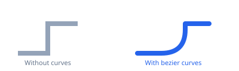

The left image connects node coordinates with straight lines. The right is what the taxiway actually looks like.

Storing smooth curves as dense coordinate lists is wasteful. A bezier curve defines the shape with 3 or 4 points, and you sample it at whatever resolution you want. Store 4 points in the file, generate 60 when rendering. The curve is smooth at any zoom level because it's computed, not approximated by a fixed number of vertices.

### Quadratic bezier (one control point)

Three points: **P0** (start), **P1** (control), **P2** (end). The curve at parameter t (from 0 to 1):

$ B(t) = (1-t)^2 P_0 + 2(1-t)t \cdot P_1 + t^2 P_2 $

This is what you get with a **111 → 112** or **112 → 111** connection.

### Cubic bezier (two control points)

Four points: **P0**, **P1** (control 1), **P2** (control 2), **P3** (end):

$ B(t) = (1-t)^3 P_0 + 3(1-t)^2 t \cdot P_1 + 3(1-t)t^2 P_2 + t^3 P_3 $

This happens with **112 → 112** connections. Two control points let you make S-curves.

### Sampling the curve

To draw a bezier, evaluate the formula at many values of t:

```typescript
type Point = [number, number]; // [lon, lat]

function sampleQuadraticBezier(
  p0: Point, p1: Point, p2: Point,
  steps = 60
): Point[] {
  const points: Point[] = [];
  for (let i = 0; i <= steps; i++) {
    const t = i / steps;
    const mt = 1 - t;
    points.push([
      mt * mt * p0[0] + 2 * mt * t * p1[0] + t * t * p2[0],
      mt * mt * p0[1] + 2 * mt * t * p1[1] + t * t * p2[1],
    ]);
  }
  return points;
}
```

60 points per curve segment is a good default. You generate coordinates once and render from the result, so the cost is negligible.

## The mirroring rule

The control point at a bezier node defines where the path goes **after** leaving that node. It is the outgoing direction.

To draw a curve **arriving** at that node, you need the incoming direction. That's the opposite side.

**Mirror the control point.** Flip it across the node, same distance:

```typescript
function mirrorControl(node: Point, control: Point): Point {
  return [2 * node[0] - control[0], 2 * node[1] - control[1]];
}
```

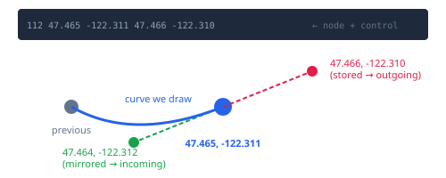

The stored control point is like an arrow pointing where you're going next. To find where you came from, point the arrow the other way.

> **Gotcha:** If you use the stored control directly for incoming curves, every curve bends the wrong way.

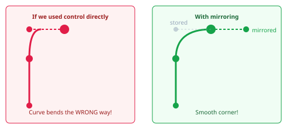

## The four connection types

There are four ways nodes can connect, depending on whether each node is plain or bezier.

### Plain to plain (111 → 111)

Straight line. No curves involved.

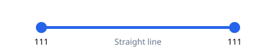

### Plain to bezier (111 → 112)

Quadratic bezier. You're arriving at a bezier node, so mirror its stored control to get the incoming tangent.

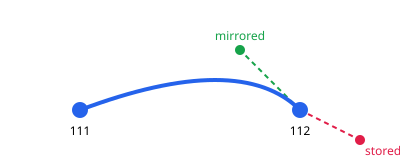

```typescript
function plainToBezier(start: Point, endNode: { pos: Point; control: Point }): Point[] {
  const mirrored = mirrorControl(endNode.pos, endNode.control);
  return sampleQuadraticBezier(start, mirrored, endNode.pos);
}
```

### Bezier to plain (112 → 111)

Quadratic bezier. You're leaving a bezier node, so use its stored control directly. No mirroring needed — the control already points in the direction you're going.

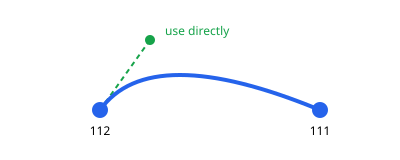

```typescript
function bezierToPlain(startNode: { pos: Point; control: Point }, end: Point): Point[] {
  return sampleQuadraticBezier(startNode.pos, startNode.control, end);
}
```

### Bezier to bezier (112 → 112)

Cubic bezier with four control points. The first node's control is used directly (outgoing). The second node's control is mirrored (incoming).

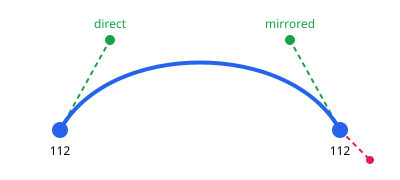

```typescript
function bezierToBezier(
  startNode: { pos: Point; control: Point },
  endNode: { pos: Point; control: Point }
): Point[] {
  const p0 = startNode.pos;
  const p1 = startNode.control;           // outgoing: use directly
  const p2 = mirrorControl(endNode.pos, endNode.control); // incoming: mirror
  const p3 = endNode.pos;
  return sampleCubicBezier(p0, p1, p2, p3);
}
```

Getting the controls backwards gives you spaghetti. The starting node's control always goes direct, the ending node's always gets mirrored.

## Sharp corners — split beziers

Bezier curves are smooth by nature. The control point at a node ensures the incoming and outgoing tangents are aligned, so the path flows through without breaking.

But sometimes you need an actual sharp corner. A taxiway that turns 90 degrees, a pavement edge with a crisp angle.

X-Plane's trick: place **two nodes at the exact same position** with different control points.

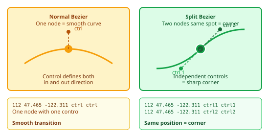

```
112 47.465 -122.311 47.465 -122.312    ← First node, control pointing up
112 47.465 -122.311 47.466 -122.311    ← Second node, same position, control pointing right
```

Both nodes sit at the same coordinates. But their control points aim in different directions. The first node handles the incoming curve. The second handles the outgoing curve. Because they're independent, the tangents don't have to line up. You get a corner.

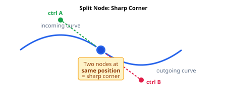

### The spike trap

Here's the problem: when your parser sees two consecutive nodes at the same position, it tries to draw a curve from a point to itself. A bezier from a point to itself creates a spike artifact.

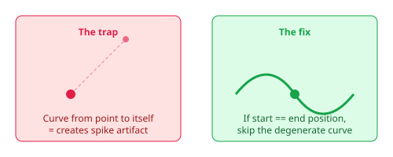

Before drawing any curve, check if start and end are the same point. If they are, skip the curve — but still add the coordinate. (The coordinate matters for type tracking; see [the linear features post]().)

```typescript
// From pathParser.ts — epsilon comparison, not exact equality
const COORD_EPSILON = 1e-9;

function coordsEqual(a: Point, b: Point): boolean {
  return Math.abs(a[0] - b[0]) < COORD_EPSILON
      && Math.abs(a[1] - b[1]) < COORD_EPSILON;
}

// When processing a node:
if (coordsEqual(previousPos, currentPos)) {
  // Split bezier — skip the curve, but still add the coordinate.
  // The coordinate matters for type tracking (see the linear features post).
  addCoordinate(currentPos);
} else {
  // Normal curve
  const points = sampleQuadraticBezier(previousPos, control, currentPos);
  addPoints(points);
}
```

Note the epsilon comparison. Floating point equality is unreliable, so the real parser uses `1e-9` as a threshold.

## Winding order — holes and fills

A taxiway shape might have holes cut out of it: buildings, equipment pads, whatever the scenery developer wanted to exclude from the pavement surface.

How does the format distinguish the outer boundary from the holes? Winding order. The direction you trace the points matters.

- **Counter-clockwise** = outer boundary (fill this)
- **Clockwise** = hole (cut this out)

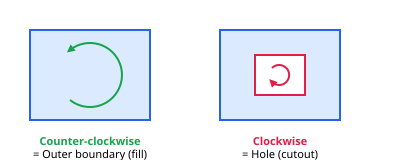

To detect winding order, calculate the signed area:

```typescript
function getSignedArea(coords: Point[]): number {
  let area = 0;
  for (let i = 0; i < coords.length - 1; i++) {
    const [x1, y1] = coords[i];
    const [x2, y2] = coords[i + 1];
    area += (x2 - x1) * (y2 + y1);
  }
  return area / 2;
}

function isHole(coords: Point[]): boolean {
  return getSignedArea(coords) < 0; // negative = clockwise = hole
}
```

A single pavement can contain multiple closed rings. After a 113/114 closes a ring, more nodes can follow to define additional rings:

```
110 1 0.25 0.00 Apron with building cutout
111 47.464 -122.312              ← Outer ring (counter-clockwise)
111 47.465 -122.312
111 47.465 -122.311
113 47.464 -122.311              ← Ring closes
111 47.4643 -122.3117            ← Hole starts (clockwise)
111 47.4647 -122.3117
111 47.4647 -122.3113
113 47.4643 -122.3113            ← Hole closes
```

One `110` header, two closed rings. First ring is the pavement surface. Second is a hole punched through it.

## The parsing pipeline

Putting it all together, here's how to parse a pavement from start to finish:

1. **Read the header.** Row code 110 gives you surface type, smoothness, texture heading, and name.
2. **Process nodes as a state machine.** Track whether you're in a bezier sequence. For each new node, determine which of the four connection types applies, and generate the appropriate line or curve.
3. **Handle ring closure.** When you hit 113/114, process the closing node, then re-process the first node to complete the loop. If the first node was a 112, its control point defines the tangent for the final curve segment.
4. **Detect holes.** Check winding order on each ring. Counter-clockwise is the fill, clockwise rings are holes.
5. **Emit GeoJSON** (or whatever format you need). The outer ring is the polygon exterior, holes go in the `coordinates` array as inner rings.

> **Gotcha: coordinate swap.** apt.dat uses `latitude longitude`. GeoJSON and most map libraries expect `[longitude, latitude]`. Swap them.

```typescript
// apt.dat line: 111 47.464000 -122.312000
const lat = parseFloat(tokens[1]); // 47.464
const lon = parseFloat(tokens[2]); // -122.312
const coord: Point = [lon, lat];   // GeoJSON order: [lon, lat]
```

> **Gotcha: ring closure re-processes the first node.** When 113/114 closes a ring, process the closing node, then re-process the first node. If the first node is a 112, its control point defines the tangent for the closing curve. Skip this and the closure segment is a straight line where there should be a curve.

Here's the ring closure logic from the real parser:

```typescript
// From pathParser.ts — ring closure logic
case RowCode.RING_SEGMENT:  // 113
case RowCode.RING_CURVE:    // 114
  // Process the closing node
  processRow(rowCode === RowCode.RING_CURVE, tokens);
  // Re-process first node to close the loop with correct bezier tangent
  if (firstRow) processRow(firstRowIsBezier, firstRow);
  // Finalize this ring
  finalizePath(coordinates, properties, lineTypes);
  // Reset state for next ring (potential hole)
  coordinates = [];
  inBezier = false;
  tempBezierNodes = [];
  firstRow = null;
  continue;
```

## Pavement edge markings

Pavements aren't just filled shapes. Their boundary nodes can carry painted edge lines and embedded lights.

The full node format has optional trailing fields:

```
111 latitude longitude [line_type] [light_type]
112 latitude longitude ctrl_lat ctrl_lon [line_type] [light_type]
```

Real example:

```
110 1 0.25 0.00 Apron B
111 47.464 -122.311 0 0
111 47.465 -122.311 0 0
112 47.466 -122.310 47.465 -122.310 30 102
114 47.464 -122.310 30 102
```

The `30 102` means: paint a solid red line along this edge and embed blue omnidirectional lights. The pavement boundary doubles as a linear feature. Instead of tracing two separate features — a pavement and a painted line on top of it — you define both at once.

For the full line type and light type reference, see [the linear features post]().

## Worked example

Let's trace through parsing this pavement:

```
110 1 0.25 0.00 Taxiway A
111 47.464000 -122.312000
111 47.465000 -122.312000
112 47.465500 -122.311500 47.465500 -122.312000
111 47.465500 -122.310000
113 47.464000 -122.310000
```

| Step | Code | Action | Result |
|------|------|--------|--------|
| 1 | 111 | First node. Record position. | `[-122.312, 47.464]` |
| 2 | 111 | 111→111: straight line | Add `[-122.312, 47.465]` |
| 3 | 112 | 111→112: quadratic bezier (mirror control) | ~60 curve points |
| 4 | 111 | 112→111: quadratic bezier (control direct) | ~60 curve points |
| 5 | 113 | Ring close: process node, then re-process first node | Close polygon |

Winding order check: counter-clockwise. This is an outer boundary, not a hole.

The result as GeoJSON:

```json
{
  "type": "Feature",
  "geometry": {
    "type": "Polygon",
    "coordinates": [[ [-122.312, 47.464], [-122.312, 47.465], ... ]]
  },
  "properties": { "name": "Taxiway A", "surface": 1, "smoothness": 0.25 }
}
```

## Reference — common mistakes

1. Only implementing quadratic beziers. When two 112 nodes are consecutive, you need a cubic bezier with four control points. Quadratics will look close but you'll get kinks on S-curves.

2. Low resolution curves. Too few sample points (8 or 16) makes curves faceted at close zoom. 60 per segment is a good default.

3. Duplicate points at segment boundaries. The end of one bezier is the start of the next. Check if the new point matches the last point before appending, or you'll get tiny rendering artifacts and bloated arrays.

4. The first node has no incoming curve. If a path starts with 112, just record its position and control. The curve gets drawn when the second node is processed.

5. Control points can be anywhere. Very close to the node means a gentle curve. Very far means a sharp bend. At the same position as the node is effectively a plain node.

## Resources

- [Understanding the Logic of Bezier Control Points in apt.dat](https://forums.x-plane.org/forums/topic/66713-understanding-the-logic-of-bezier-control-points-in-aptdat/) — Forum thread explaining the mirroring logic
- [Carlos Bergillos' blog post on apt.dat](https://cbergillos.com/blog/2022-07-11-xplane-aptdat/) — Format structure walkthrough
- [xplane_apt_convert](https://github.com/CarlosBergillos/xplane_apt_convert) — Python library for converting apt.dat to GeoJSON and other formats
- [X-Plane Scenery Gateway](https://gateway.x-plane.com/) — Community airport data repository
- [apt.dat specification](https://developer.x-plane.com/article/airport-data-apt-dat-file-format-specification/) — The official format documentation
- [Parsing painted lines and taxiway lights from apt.dat]() — The companion post covering linear features, line types, and segment splitting
