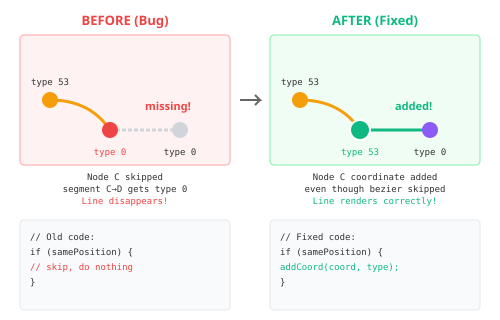

> [!ABSTRACT] TL;DR
> X-Plane linear features (row code 120) are painted taxiway markings: centerlines, hold bars, edge lines. They use the same bezier system as pavements but are stroked paths instead of filled polygons. Each node has a line type that defines the segment's appearance. The catch: when bezier curves meet at sharp corners (split beziers), you can lose type information if you're not careful. The fix: always add coordinates even when skipping degenerate curves.

## What Are Linear Features?

X-Plane airports have two kinds of geometry: **filled polygons** (taxiways, aprons, runways) and **stroked paths** (painted markings). I covered polygons in my [previous post on parsing X-Plane airport geometry](). This post focuses on the second type.

Airports have **painted markings** everywhere:

- Yellow centerlines guiding aircraft along taxiways
- Hold short bars telling pilots where to stop
- ILS critical area boundaries
- Edge lines, direction arrows, runway numbers

These aren't filled shapes, they're **stroked paths**. Lines painted on the surface.

X-Plane calls these **linear features** (row code 120).

```
120 Taxiway A centerline
111 47.464 -122.311 1 0
111 47.465 -122.311 1 0
112 47.466 -122.310 47.466 -122.311 4 102
115 47.467 -122.309 4 102
```

The format looks similar to pavements: a header line, then nodes defining the path. But instead of closing into a polygon, it ends with `115` or `116` (open path terminator). And each node has extra data: the **line type** and **light type**.

## Linear Features vs Pavements

Linear features use the same bezier system as pavements:

- **111/115**: Plain nodes (straight lines)
- **112/116**: Bezier nodes (curves with control points)
- Control points define the **outgoing** direction, so incoming curves need the control mirrored
- Multiple nodes at the same position create sharp corners (split beziers)

If you want the full deep-dive on bezier math and control point mirroring, see my [post on parsing X-Plane airport geometry]().

The differences:

| Aspect | Pavements (110) | Linear Features (120) |
|--------|-----------------|----------------------|
| Geometry | Closed polygon (fill) | Open path (stroke) |
| Terminator | 113/114 (close loop) | 115/116 (end path) |
| Extra data | None on nodes | Line type + light type |
| Result | Textured surface | Painted line |

So if you can parse pavements, you can parse linear features. The bezier logic is identical. But linear features add a layer of complexity: **per-segment styling**.

## The Line Type System

Each node in a linear feature can specify two values after the coordinates:

```
111 latitude longitude [line_type] [light_type]
112 latitude longitude ctrl_lat ctrl_lon [line_type] [light_type]
```

### Line Types

The line type determines what gets painted:

| Code | Appearance |
|:----:|------------|
| 0 | Nothing (transparent) |
| 1 | Solid yellow |
| 2 | Broken yellow |
| 3 | Double solid yellow |
| 4 | Runway hold position (bars + dashes) |
| 5 | Other hold position |
| 6 | ILS hold |
| 7 | ILS critical centerline |
| 20 | Solid white |
| 21 | Chequered white |
| 22 | Broken white |

Add **50** to any code for a black border variant (better visibility on light concrete):
- 51 = Solid yellow with black border
- 53 = Double solid yellow with black border

### Light Types

Embedded taxiway lights:

| Code | Appearance |
|:----:|------------|
| 0 | No lights |
| 101 | Green centerline (bidirectional) |
| 102 | Blue edge (omnidirectional) |
| 103 | Amber hold (unidirectional) |
| 104 | Amber pulsating |
| 105 | Alternating amber/green (bidirectional) |
| 106 | Red stop bar |
| 107 | Green centerline (unidirectional) |
| 108 | Alternating amber/green (unidirectional) |

### How Types Flow

Here's the key concept: **the type on a node defines the segment starting at that node**.

```
Node 0 (type 1)  ───segment 0→1 (type 1)───>  Node 1 (type 4)  ───segment 1→2 (type 4)───>  Node 2
```

The type on Node 0 applies to the line FROM Node 0 TO Node 1. The type on Node 1 applies to the line from Node 1 to Node 2. And so on.

If a node doesn't specify a type, it defaults to **0** (transparent/nothing). This is intentional. Some linear features have gaps.

## Segment Splitting

A single linear feature can have **multiple line types** along its length:

```
120 Taxiway centerline with hold
111 ... 1 0      ← Solid yellow
111 ... 1 0      ← Solid yellow
111 ... 4 102    ← Hold bars + blue lights
111 ... 4 102    ← Hold bars + blue lights
115 ... 4 102    ← End
```

When rendering, you can't draw this as one line with one style. You need to **split it into segments**, each with consistent styling.

The algorithm:
1. Walk through the coordinates
2. When the type changes, end the current segment
3. Start a new segment with the new type
4. Include the boundary point in both segments (for visual continuity)

```python
def split_by_type(coords, types):
    segments = []
    seg_start = 0
    seg_type = types[0]

    for i in range(1, len(coords)):
        if types[i] != seg_type:
            # Type changed - save segment including endpoint
            segments.append({
                'coords': coords[seg_start:i+1],
                'type': seg_type
            })
            # Start new segment from this point
            seg_start = i
            seg_type = types[i]

    # Final segment
    segments.append({
        'coords': coords[seg_start:],
        'type': seg_type
    })

    return segments
```

Then filter out type 0 (transparent) and render the rest with appropriate styles.

## Bezier Curves in Linear Features

Linear features use bezier curves just like pavements. The rules are identical:

- **111 → 111**: Straight line
- **111 → 112**: Quadratic bezier, mirror the control point
- **112 → 111**: Quadratic bezier, use control directly
- **112 → 112**: Cubic bezier, first direct + second mirrored

Quick refresher on control point mirroring: the control point stored at a 112 node points in the **outgoing** direction. To draw a curve arriving at that node, flip the control to the opposite side. See the [bezier mirroring section]() in my previous post for the full explanation.

### Type Inheritance in Beziers

When you interpolate a bezier curve, you generate many intermediate points. Each point needs a type for the splitting algorithm to work.

**Rule: intermediate points inherit the starting node's type. The last point gets the ending node's type.**

```
Node A (type 53) ────bezier────> Node B (type 0)

Generated points: [A, p1, p2, p3, p4, B]
Types:            [53, 53, 53, 53, 53, 0]
                   └─────────────────┘  └─┘
                   inherit from A        B's type (for next segment)
```

This makes sense: Node A's type applies to the segment starting at A (the curve). Node B's type will apply to whatever comes after B.

## The Split Bezier Problem
.

### What's a Split Bezier?

Bezier curves are inherently smooth. The incoming and outgoing curves at a node share a tangent direction. Great for rounded corners.

But sometimes you need a **sharp corner**, a 90-degree turn, an abrupt direction change.


- Normal bezier: one node, one control point, smooth flow
- Split bezier: two nodes at same position, independent controls, sharp corner

In the data:

```
112 25.123 45.678 ctrl1_lat ctrl1_lon 53 102   ← Ends incoming curve
112 25.123 45.678 ctrl2_lat ctrl2_lon 0  0     ← Same position, starts outgoing
111 25.123 45.678 53 102                       ← Or plain node, redefines type
```

Three nodes at the same coordinates. Each has its own type that applies to its outgoing segment.

### The Bug

When you detect a split bezier (start and end position are identical), you skip drawing the degenerate curve. You can't draw a curve from a point to itself.

But I was **also skipping adding the coordinate**.

Here's what happened:

```
112 ... 53 102    ← Node A: type 53
112 ... 0  0      ← Node B: same position, type 0
111 ... 53 102    ← Node C: same position, type 53 ← SKIPPED!
111 ... 0  0      ← Node D: different position, type 0
```

1. Process Node A → add bezier points ending with type 0 (Node B's type)
2. Process Node B → same position as A, skip degenerate curve, **don't add coordinate**
3. Process Node C → same position as B, skip degenerate curve, **don't add coordinate**
4. Process Node D → add coordinate with type 0

The coordinate array is missing the corner point with type 53. When splitting by type, segment C→D gets type 0 instead of 53.

Type 0 = transparent = **invisible line**.



### The Fix

Add the coordinate even when skipping the degenerate curve:

```python
def process_split_bezier(start_pos, end_pos, end_type):
    if start_pos == end_pos:
        # Same position - degenerate curve, don't draw
        # BUT still record the coordinate with its type!
        add_coord(end_pos, end_type)
        return

    # Normal curve processing...
```

The coordinate exists. Its type matters. Even if there's no curve to draw, the type information needs to propagate.

## Gotchas Specific to Linear Features

### 1. Type 0 is Intentional, Not Missing

When a node has no type specified, it defaults to 0. But type 0 isn't an error. It means "don't paint anything here."

```
120 Line with gap
111 ... 1 0     ← Painted
111 ... 0 0     ← Gap (intentional)
111 ... 1 0     ← Painted again
```

Don't treat type 0 as missing data. It's a deliberate gap in the marking.

### 2. First Bezier Node is Special

If a linear feature starts with a 112 (bezier) node:

```
120 Curved line
112 ... ctrl 53 102    ← First node, bezier
112 ... ctrl 0  0      ← Second node
```

There's no curve TO the first node. It's the starting point. Just record its position and control. The curve will be drawn when processing the second node.

### 3. Types Can Change Mid-Curve

A bezier curve might span from one type to another:

```
111 ... 1 0      ← Type 1
112 ... 4 102    ← Type 4
```

The curve from Node 0 to Node 1 is drawn. But what type is it?

Per the rule: intermediate points get the starting node's type (1), the endpoint gets the ending node's type (4).

When you split by type, the curve ends up in the type-1 segment, and the endpoint becomes the start of the type-4 segment. The visual result is correct. The style changes at the node position.

### 4. Lights and Paint Are Independent

A node can have:
- Paint only: `111 ... 1 0`
- Lights only: `111 ... 0 102`
- Both: `111 ... 1 102`
- Neither: `111 ...` or `111 ... 0 0`

You might have invisible guide lights (type 0 paint, type 102 lights) or unlit painted lines.

### 5. Multiple Nodes at Same Position

At sharp corners, expect 2-3 nodes at identical coordinates:

```
112 ... ctrl_in  53 102   ← Incoming bezier ends here
112 ... ctrl_out 0  0     ← Outgoing bezier starts here
111 ... 53 102            ← Plain node redefining type
```

Each node contributes something:
- First: ends incoming curve
- Second: starts outgoing curve with different control
- Third: may redefine type for next segment

Don't deduplicate coordinates blindly. You'll lose type information.

### 6. Single Value Ambiguity

Sometimes a node has only one value after coordinates:

```
111 47.464 -122.311 102     ← Is this line type 102 or light type 102?
```

The trick: **line types max out at 92, light types start at 101**.

If the single value is ≥100, it's a light type. Otherwise, it's a line type.

```python
def parse_type_value(value):
    if value >= 100:
        return (0, value)      # (line_type=0, light_type=value)
    else:
        return (value, 0)      # (line_type=value, light_type=0)
```

This disambiguation is necessary because some apt.dat files omit the second value when it's zero.

## The Complete Pipeline

1. **Parse nodes**: Extract position, control point (if bezier), line type, light type
2. **Generate coordinates**: Connect nodes with lines/curves, interpolate beziers
3. **Assign types**: Intermediate bezier points get starting type, endpoints get their own type
4. **Handle split beziers**: Add coordinates even when skipping degenerate curves
5. **Split by type**: Group consecutive coordinates with same type into segments
6. **Filter**: Remove type 0 (transparent) segments
7. **Render**: Draw each segment with appropriate line style

## Summary

Linear features reuse the bezier system from pavements. Same node codes, same control point math. The added complexity is per-segment styling through line types.

The key insights:
- Type on a node = style for segment **starting** at that node
- Bezier intermediate points inherit starting node's type
- Split beziers need coordinates added even when curves are skipped
- Type 0 is intentional transparency, not missing data

Get these right, and your taxiway markings will render correctly, including at those tricky sharp corners where bezier curves meet.


## Resources

- [Parsing X-Plane Airport Geometry]() - Companion post on pavements and bezier math
- [apt.dat specification](https://developer.x-plane.com/article/airport-data-apt-dat-file-format-specification/) - Official format documentation
- [xplane_apt_convert](https://github.com/CarlosBergillos/xplane_apt_convert) - Python library for apt.dat conversion
- [X-Plane Scenery Gateway](https://gateway.x-plane.com/) - Community airport data repository
