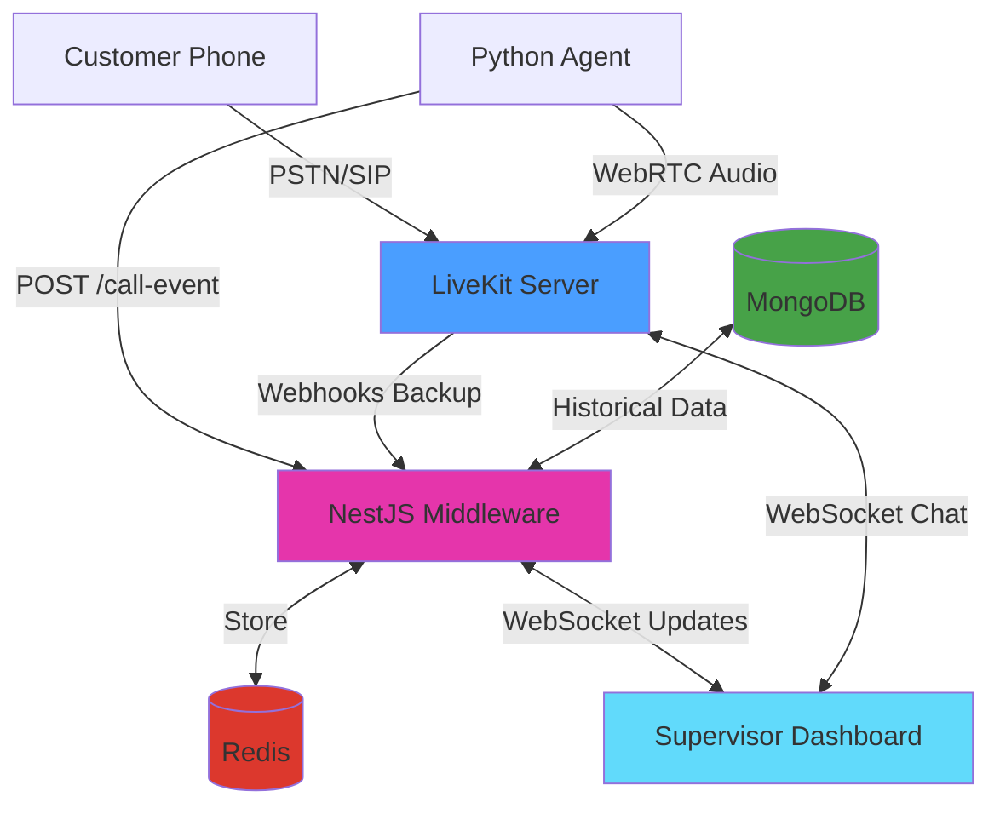
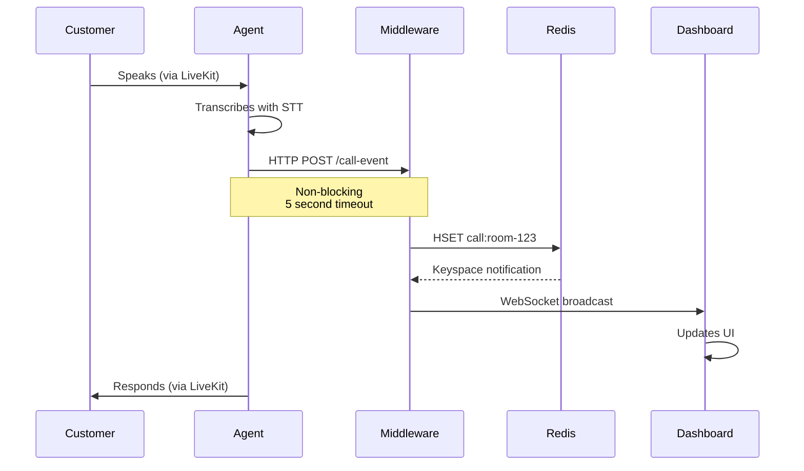
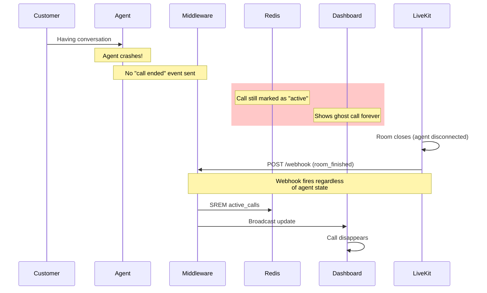
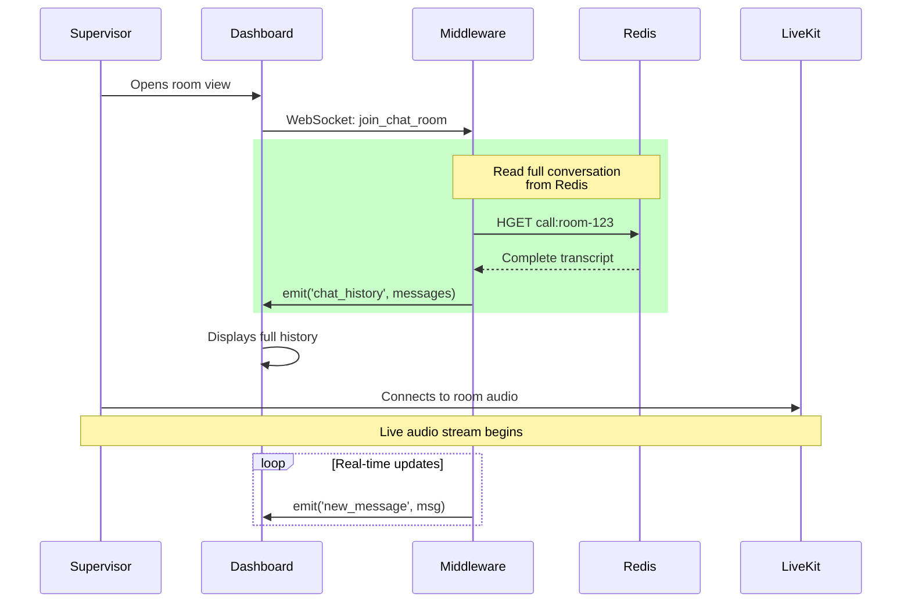

import Figure from '../../../components/Figure.astro';

> [!ABSTRACT] TL;DR
> Built a real-time monitoring dashboard for AI voice agents using LiveKit's participant model. Supervisors join calls as regular participants, middleware handles state sync via Redis, and webhook fallbacks prevent ghost calls. Four days from concept to production.

I had a voice agent working in production. Nothing fancy - the usual STT → LLM → TTS pipeline that everyone's building these days. (I'll write about that setup in a separate post, but if you've seen one voice agent architecture, you've seen them all.)

The agent handled calls fine. Natural-sounding voice, could hold a conversation, didn't embarrass itself too often. We had the testing setup - datasets covering different scenarios, LLM-as-judge evals in [Langfuse][langfuse], post-call transcript analysis, the works.

But all of that happens after the call.

The AI might completely misunderstand someone right now. A customer might be getting frustrated this second, needing a human while we make them sit through three more minutes of AI troubleshooting. We'd see it in the post-call analytics. We'd adjust our prompts, add it to the test suite, prevent it from happening to the next customer.

Great for iteration. Terrible for the person on the phone right now.

I started digging through [LiveKit's documentation][livekit-docs] looking for some monitoring API, maybe a way to tap into calls and observe them live. I was mentally preparing to build some complex system that hooks into media streams from the outside when I noticed something about LiveKit's architecture.

LiveKit works through [rooms][livekit-rooms] - realtime sessions where [participants][livekit-participants] connect. A participant can be a user, an agent, or anything that needs to send or receive audio/video/data. Each participant publishes tracks (audio, video) and subscribes to tracks from other participants.

When a call happens:

- Customer joins the room as a participant (via [WebRTC][webrtc] or [SIP][livekit-sip] if calling from a phone), publishes their audio
- AI agent joins the room as a participant, subscribes to customer audio, publishes its own audio back
- They communicate through LiveKit's media server

What if supervisors could join the room too?

Not as some special observer with a monitoring system watching from outside. Just join as another participant. Subscribe to both the customer's and agent's audio tracks to listen. Publish their own audio track to speak. Mute the agent's track to take over.

The platform had everything we needed.

---

## What I Built

I built two things: a real-time supervisor dashboard where you can monitor and intervene in AI phone calls, and the backend infrastructure that makes it work.

The dashboard is what supervisors see and use. The backend is what solves the hard problems - conversation history, ghost call prevention, and real-time synchronization.
I built two different views because I wasn't sure which one would be useful in practice.

> [!TIP]
> I used [LiveKit's Next.js starter](https://github.com/livekit-examples/agent-starter-react) as the foundation.

**Bubble View**

This one looks ridiculous. I like it. Calls appear as glowing bubbles floating in a hexagonal grid. When someone's speaking, their bubble pulses. Happy customers are green, frustrated ones are red.

The inspiration came from the Apple Watch - how do you pack maximum information into minimal space? I thought: why not apply that to call monitoring? Instead of boring rows of data, make each call a living, breathing bubble that tells you everything at a glance.

Negative sentiment calls automatically drift toward the center of the screen. So when you've got 10+ calls happening at once, the ones that need attention are literally harder to miss.

<Figure
  src="/images/ai-voice-agent-supervisor/animation_bubble.gif"
  caption="Bubble view in action. Red = angry customer, green = happy customer. The pulsing means someone's talking right now."
/>

I had time, a motion animation library, and free will. This is what happened.

**How it works:**

The bubble positioning isn't random - it uses a hexagonal packing algorithm. Think honeycomb. I wrote a function that calculates positions in concentric rings:

- Center position (layer 0): 1 bubble
- First ring (layer 1): 6 bubbles in a perfect hexagon
- Second ring (layer 2): 12 bubbles
- Each subsequent ring adds 6 more positions

```typescript
// Simplified version of the algorithm
function getHexagonalRingPositions(layer, radius, centerX, centerY) {
  if (layer === 0) return [{ x: centerX, y: centerY }];
  const distance = radius * layer * 1.2;
  const positions = [];
  if (layer === 1) {
    // First ring: 6 positions at 60-degree intervals
    for (let i = 0; i < 6; i++) {
      const angle = (i * Math.PI) / 3;
      positions.push({
        x: centerX + Math.cos(angle) * distance,
        y: centerY + Math.sin(angle) * distance
    ..... More

  return positions;
}
```

Priority placement happens before positioning. Calls get sorted by sentiment - negative sentiment gets priority 0 (highest), neutral gets 1, positive gets 2 (lowest). Then they fill positions from center outward. So when someone's frustrated, their bubble ends up in the inner rings automatically. No manual intervention needed.

The bubbles themselves are built with Framer Motion for the animations and a custom particle system (tsparticles) for the sparkle effects. Each bubble's particle density and speed changes based on the agent's state - more particles when thinking, faster when speaking.

**Card View**

Sometimes you want a normal grid. This shows all the important details at a glance - who's on the call, how long they've been talking, current sentiment, that sort of thing.

<Figure
  src="/images/ai-voice-agent-supervisor/card_view.png"
  caption="Traditional card grid view for when you want details without the fancy graphics."
/>

**Room View**

Click any call to enter the monitoring interface.

<Figure
  src="/images/ai-voice-agent-supervisor/room_view.webp"
  caption="Inside a call. Live transcript on the left, audio controls on the right, debug panel at the bottom."
/>

You get:

- Live transcript of everything being said (updates as people speak)
- Audio controls to listen, speak, or take over
- Debug panel showing what the AI is doing under the hood
- Connection stats because sometimes you need to know if the lag is your problem or theirs

**The Control Bar**

This is where you intervene:

<Figure
  src="/images/ai-voice-agent-supervisor/control_bar.png"
  caption="The 'oh shit' buttons. Mute the AI, take over, or transfer to a human agent."
/>

- Mute the AI (it shuts up but keeps listening)
- Unmute yourself (now you're talking to the customer)
- Transfer to call center (route them to a human agent)
- All the usual call stats (latency, packet loss, bitrate)

The controls are dead simple because when something's going wrong, you don't have time to figure out a complicated UI.

**Post-Call Analytics**

Beyond live monitoring, there's a separate analytics view for the business side - call volume trends, average handle time (AHT), average talk time (ATT), completion rates. Standard call center KPIs pulling from the MongoDB archives.

<Figure
  src="/images/ai-voice-agent-supervisor/post_call.png"
  caption="Post-call analytics dashboard"
/>

This wasn't interesting to build - just queries on archived call data. But it's what operational people looks at.

---

### What You Can Do

Once you're in a call, you've got five options:

**1. Silent Observer Mode**

Join any call and just listen. The customer has no idea you're there. The AI keeps doing its thing, you're just watching to see how it handles the situation. Useful for quality assurance or when you want to see if the AI can recover from a mistake on its own.

**2. Guide the AI via Text**

This one's unusual but effective. You can type messages to the AI, and it'll speak your instructions to the customer.

Type: "Tell them we're closed today"

AI says: "I'm sorry to inform you that we're currently closed today. Please try calling back tomorrow during business hours."

It works because I had to override LiveKit's default text handling. Normally, the agent only accepts text from the participant it's bound to (the customer). I added a custom handler that also accepts messages from participants with `supervisor_` prefix in their identity:

```python
def custom_text_handler(reader, participant_identity):
    # Security check: only supervisors and the linked participant
    if not (participant_identity.startswith("supervisor_")
            or participant_identity == agent_session._room_io._participant_identity):
        return

    # Read supervisor's text
    text = await reader.read_all()

    # Interrupt agent and inject the text as a user message
    agent_session.interrupt()
    agent_session.generate_reply(user_input=text)
```

The LLM has instructions in its system prompt to handle supervisor messages specially - it knows these are instructions to relay to the customer, not questions from the customer. A bit creepy? Yeah. But it works for the MVP and supervisors love it.

> [!CAUTION]
> Security-wise, this is obviously not production-ready. Anyone who can join with `supervisor_` in their identity can control the AI. For production, you'd want proper auth tokens and role validation.

**3. Take Over**

Hit the "Take Over" button. AI goes silent (but keeps listening). Now it's you and the customer. You handle the call like a normal human agent would.

This uses LiveKit's `RoomServiceClient.mutePublishedTrack()` API. The frontend makes a POST to `/api/mute-agent` which calls:

```typescript {title="mute_agent.ts"}
await roomService.mutePublishedTrack(
  roomName,
  agentIdentity,
  trackSid,
  muted: true
);
```

The AI's audio track gets muted, but it stays in the room. It can still hear everything - useful if you want to hand back with full context.

**4. Hand Back**

Done talking? Hit "Hand Back." Same API call but with `muted: false`. AI unmutes and picks up the conversation. It heard everything you said while muted, so the transition is usually pretty smooth. No awkward "what were we talking about?" moments.

**5. Transfer Out**

Sometimes you just need to route them to a real human agent. Click transfer, pick a language (English/Malay), and we do a SIP transfer:

```typescript
await sipClient.transferSipParticipant(
  roomName,
  participantIdentity,
  transferTo,
  sipTransferOptions,
);
```

The customer's experience is just like any other call transfer. They hear a brief message, maybe some hold music, then they're connected to the call center queue.

---

## Behind The Scenes

Remember how I said supervisors just join the room as another participant? That's true for audio. But there's a problem: **LiveKit is stateless by design.**

Join a room mid-call and you see... nothing. No message history, no conversation context, no idea what's been happening for the last five minutes. Great for privacy, terrible for supervisors trying to help.

First time a supervisor joined a live call, they asked: "Is the agent even talking? What's the customer's problem?" The audio worked fine. Everything else was blank.

I needed to solve three things:

1. Store conversation history somewhere
2. Give supervisors that history when they join
3. Keep everything synchronized in real-time

---

## The Architecture

I kept it simple: three pieces that talk to each other in specific ways.



Three layers, each doing one thing well:

### 1. The Voice Layer (LiveKit)

All audio goes through LiveKit for transport.

Customer calls via PSTN → SIP provider → LiveKit SIP bridge → LiveKit server → AI agent connects as participant

Supervisor joins the same room as another participant. Everyone can hear each other, publish audio, subscribe to tracks. LiveKit handles all the WebRTC complexity - the actual audio routing, codec negotiation, network traversal.

It's fast.

### 2. The State Layer (NestJS + Redis)

The middleware serves **two critical purposes**, and understanding why requires knowing what can go wrong.

---

## The Event Flow (When Everything Works)

Here's the happy path - what happens during a normal call:



**Primary: Agent Event Processing**

Every time something happens - customer speaks, AI responds, sentiment changes - the agent sends an HTTP event to the middleware:

```python {title="call_event_store.py"}
class CallEventStore:
    def __init__(self):
        self.webhook_url = os.getenv("CALL_SUPERVISOR_URL")
        self.timeout = httpx.Timeout(5.0)

    def store_call_event(self, room_name: str, session_id: str,
                         event_type: str, data: dict) -> bool:
        payload = {
            "room_name": room_name,
            "session_id": session_id,
            "event_type": event_type,
            "data": data,
        }

        response = client.post(
            f"{self.webhook_url}/call-event",
            json=payload,
            headers={"X-API-Key": self.api_key},
        )
        return response.status_code == 200
```

If the middleware is down? **The call continues.** The agent doesn't wait around. Middleware problems should never break customer calls.

The middleware stores everything in Redis and broadcasts updates via WebSocket to any connected dashboards.

---

## The Disaster Scenario (Why We Need Livekit Server Webhooks)

Two days after launch, the dashboard showed 23 active calls. Only 3 were real. The rest were ghosts - calls that ended hours ago but never disappeared. Supervisors were clicking into dead rooms, confused why nobody was talking.

Here's what was happening:



**Secondary: Webhook Fallback (The Safety Net)**

**The problem: what if the agent crashes before sending the "call ended" event?**

You end up with ghost calls. Dashboard shows them as active forever. Redis has stale data. MongoDB never gets the final record. Supervisors can't tell if it's a real call or a zombie.

This is where LiveKit webhooks become critical. LiveKit's server sends webhooks for room lifecycle events **regardless of what the agent does**. Room closes? Webhook fires. Agent crashes mid-call? Room still closes, webhook still fires.

```typescript
@Post('webhook')
async handleLivekitWebhook(@Headers('authorization') authHeader: string) {
  const event: WebhookEvent = await this.webhookReceiver.receive(
    req.body,
    authHeader
  );

  switch (event.event) {
    case 'room_finished':
      // Clean up even if agent never reported end
      await this.redisService.getClient().srem('active_calls', roomName);
      await this.publishActiveCallsUpdate();
      break;
  }
}
```

> [!NOTE]
> Two paths for the same event:
>
> 1. **Primary path:** Agent sends HTTP event → Middleware processes → Redis updated
> 2. **Backup path:** Agent crashes → LiveKit webhook fires → Middleware catches it → Redis cleaned up anyway

No more ghost calls.

---

## The Late-Join Problem

This is why the architecture is necessary. When a supervisor joins mid-call:



When a supervisor connects and joins a chat room, the gateway immediately dumps the full conversation history:

```typescript
@SubscribeMessage('join_chat_room')
async handleJoinChatRoom(@MessageBody() roomName: string,
                         @ConnectedSocket() client: Socket) {
  await client.join(`chat:${roomName}`);

  // Get full conversation from Redis
  const messages = await this.realtimeService.getChatMessages(roomName);

  // Send everything at once
  client.emit('chat_history', messages);

  return {status: 'joined_chat_room', roomName};
}
```

From that point forward, they receive live updates as they happen. This is why the middleware exists - Redis becomes the source of truth for conversation history.

### 3. The Control Layer (Next.js Dashboard)

The supervisor dashboard connects through three separate channels:

- **LiveKit WebRTC** - Direct audio streams for listening/speaking
- **NestJS WebSocket** - State updates and chat history
- **LiveKit API** - Control actions (mute/unmute/transfer)

Three channels, each optimized for what it does best.

---

## Real-Time Updates Without Polling

The dashboard never polls. Instead, Redis has a feature called keyspace notifications - you can subscribe to patterns and get notified when keys change.

The middleware subscribes to `__keyspace@0__:call:*` which means "tell me every time any call data changes." When the agent updates `call:room-123`, Redis fires a notification, the middleware sees it, grabs the latest data, and pushes it to connected dashboards via Socket.IO.

When someone's speaking, updates fire constantly. Every transcription chunk triggers a notification. That's too much, so I added debouncing - updates get batched, multiple changes within 50ms get collapsed into one broadcast. The dashboard sees smooth updates without getting hammered.

---

## Real-Time Debug & Metrics

One of the most valuable features: **live instrumentation** from the agent.

The Python agent streams debug events directly to the dashboard using LiveKit's text messaging with a dedicated topic channel. This is invaluable for QA and testers - they can watch exactly what the agent is doing in real-time, see which tools fire, angent handoff, state change, system prompts, track LLM response times, and debug issues without digging through logs.

```python
class DebugSender:
    @staticmethod
    def send_debug_event(event_type: str, data: dict[str, Any]):
        asyncio.create_task(
            DebugSender._send_debug_event(event_type, data)
        )

    @staticmethod
    async def _send_debug_event(event_type: str, data: dict[str, Any]):
        job_ctx = get_job_context()

        debug_payload = {
            "event": event_type,
            "data": data,
            "type": "debug",
            "timestamp": time.time()
        }

        await job_ctx.room.local_participant.send_text(
            json.dumps(debug_payload),
            topic="agent-debug"
        )
```

The dashboard subscribes to the `agent-debug` topic and receives these events in real-time without polling. Events are sent asynchronously (fire-and-forget) so they never block the agent's STT → LLM → TTS pipeline.

What gets streamed:

- Agent state transitions (initializing → listening → thinking → speaking)
- Tool calls with parameters and results
- LLM time-to-first-token and total latency
- STT/TTS performance metrics
- RAG query results
- API calls to external services

<Figure
  src="/images/ai-voice-agent-supervisor/debug_events.png"
  caption="Debug panel showing live agent state transitions and performance metrics"
/>

The agent subscribes to LiveKit's metrics hooks and forwards everything to the dashboard:

```python
@session.on("metrics_collected")
def on_metrics_collected(ev) -> None:
    DebugSender.send_metrics_event(ev)
```

---

<Figure
  src="/images/ai-voice-agent-supervisor/metrics.png"
  caption="Debug panel with live events"
/>

> [!TIP]
> Debug events aren't persisted - they're real-time only. The metrics get saved to Langfuse for historical analysis, but the debug stream is ephemeral. It exists for live monitoring.

---

## The Tricky Parts

### Sentiment Analysis

We needed to know if a call was going badly **before** the customer started yelling. I went with a sentiment analysis model for the MVP - run each user transcript through it, get back negative/neutral/positive with a confidence score, attach it to the message.

The frontend uses this to color-code messages and position bubbles in the hexagonal grid. Negative sentiment automatically drifts toward the center.

Could swap this for a small LLM like Llama 3.2 8B with structured output. Probably more accurate, definitely more expensive to run.

---

## What I'd Do Differently

### Agent Muting Implementation

Currently, muting the agent only silences their audio track. The agent's state machine keeps running: listening → thinking → speaking. It generates LLM responses and synthesizes speech that nobody hears.

### Chat History Synchronization

The agent pushes the entire conversation history to the middleware on every message. Middleware broadcasts this to all connected frontends, which then diff the arrays to animate only new messages. Wasteful. Should switch to event-based updates - send only deltas, not full state snapshots.

### Room Lifecycle Management

There's a race condition: if a call ends and the room closes, but the frontend hasn't updated yet, supervisors can click the stale room entry and accidentally create a new empty room with the same name. If the agent fails to send the end-call event and a supervisor clicks the stale room before the webhook arrives, it creates a new room instance.

Current mitigation: webhook fallback catches most cases, rooms auto-expire after timeout. Proper fix needs idempotent room handling and better state reconciliation between agent events and webhooks.

### Horizontal Scaling

Single Redis instance, single middleware instance. On paper, everything can scale horizontally - Redis clustering, multiple middleware nodes with session affinity. In practice, untested beyond current load.

---

## The Tech Stack

**Voice Agent**

- Python + [LiveKit Agents SDK][livekit-agents] (multi-agent workflow)
- [Whisper V3][whisper] (speech-to-text)
- [Qwen 2.5 32B][qwen], self-hosted (conversation LLM)
- Custom TTS, self-hosted (voice synthesis)

**Middleware**

- [NestJS][nestjs] (event processing & WebSocket gateway)
- [Redis][redis] (active call state, message buffering)
- [MongoDB][mongodb] (call archives, historical data)

I picked NestJS because it had WebSocket support, Redis integration, and decent architectural patterns built in. Also wanted to work more with TypeScript beyond React.

**Dashboard**

- [Next.js][nextjs] (supervisor interface)
- [LiveKit Components React][livekit-components] (voice integration)
- [Framer Motion][framer-motion] (animations)
- [tsparticles][tsparticles] (particle effects)

**Observability**

- [Langfuse][langfuse] (LLM metrics, traces, performance monitoring)

---

## Questions?

Building something similar? Have questions about the architecture? Found a better way to solve the ghost call problem? Reach out on [LinkedIn][linkedin].

{/* Link references */}
[langfuse]: https://langfuse.com/
[livekit-docs]: https://docs.livekit.io/
[livekit-rooms]: https://docs.livekit.io/home/get-started/api-primitives/#room
[livekit-participants]: https://docs.livekit.io/home/get-started/api-primitives/#participant
[livekit-tracks]: https://docs.livekit.io/home/get-started/api-primitives/#track
[livekit-subscription]: https://docs.livekit.io/home/get-started/api-primitives/#track-subscription
[livekit-sip]: https://docs.livekit.io/sip/
[livekit-agents]: https://docs.livekit.io/agents/
[livekit-components]: https://docs.livekit.io/reference/components/react/
[webrtc]: https://webrtc.org/
[whisper]: https://github.com/openai/whisper
[qwen]: https://huggingface.co/Qwen
[nestjs]: https://nestjs.com/
[redis]: https://redis.io/
[mongodb]: https://www.mongodb.com/
[nextjs]: https://nextjs.org/
[framer-motion]: https://www.framer.com/motion/
[tsparticles]: https://particles.js.org/
[linkedin]: https://linkedin.com/in/lyes-tarzalt
