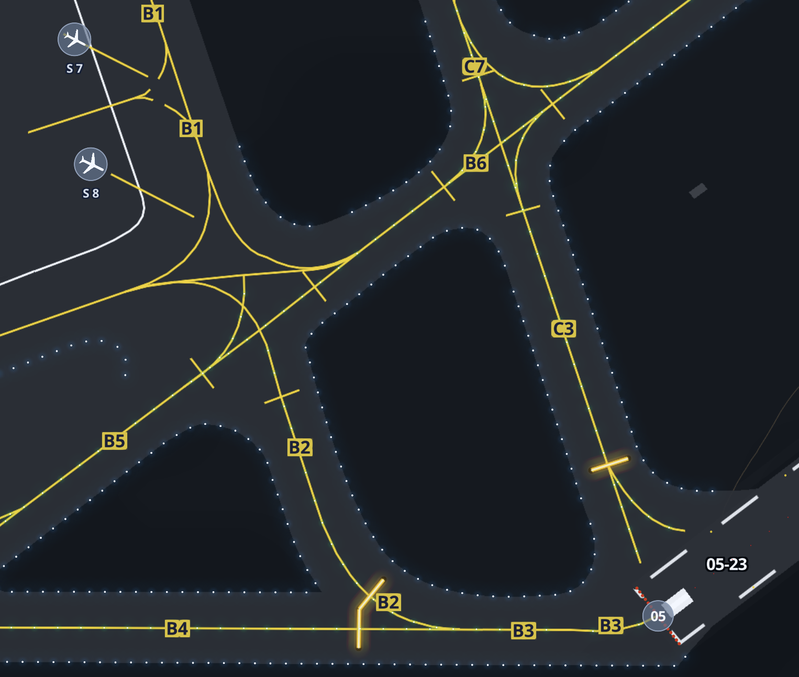
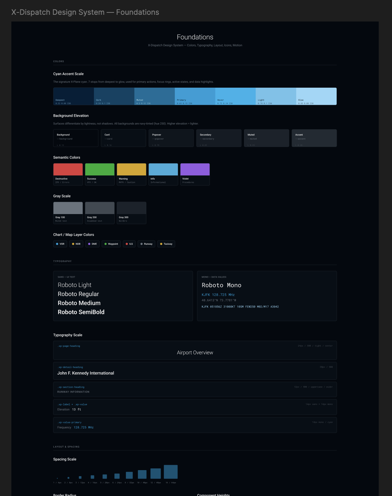

import { Image } from 'astro:assets';
import { Button } from '@/components/ui/button';
import { Separator } from '@/components/ui/separator';
import { AirportDiagram } from '@/components/AirportDiagram';
import mapImg from '@/assets/projects/x-dispatch/map.png';
import flightSetupImg from '@/assets/projects/x-dispatch/screenshots/x-dispatch-flight-setup.png';
import terrainImg from '@/assets/projects/x-dispatch/terrain.png';
import weatherImg from '@/assets/projects/x-dispatch/screenshots/x-dispatch-weather.png';
import proceduresImg from '@/assets/projects/x-dispatch/screenshots/x-dispatch-procedures.png';
import addonImg from '@/assets/projects/x-dispatch/screenshots/x-dispatch-addon1.png';

<div className="not-prose mt-2 mb-4">
  <div className="mb-3 flex items-baseline justify-between">
    <p className="font-mono text-[0.625rem] uppercase tracking-[0.2em] text-muted-foreground/70">
      Live · LFMN Nice Côte d’Azur
    </p>
    <p className="font-mono text-[0.625rem] text-muted-foreground/50">
      the parser, in your browser
    </p>
  </div>
  <div className="relative aspect-[16/10] sm:aspect-[16/9] overflow-hidden rounded-2xl border border-border bg-card/40">
    <AirportDiagram client:visible variant="interactive" showCaption={false} />
  </div>
  <p className="mt-3 text-xs leading-relaxed text-muted-foreground">
    Drag to pan, scroll to zoom. The whole shape that follows in the post is what gets parsed out of{' '}
    <code className="font-mono text-[0.6875rem]">apt.dat</code>: runways, taxiways, painted
    markings, hold lines.
  </p>
</div>

[X-Plane](https://www.x-plane.com/) is a flight simulator, part of a scene that includes FSX, Prepar3D, MSFS, and a community that's been around for decades. Some people fly for fun, some like operating complex aircraft with all their systems, some build addons. I've been in it since I was a kid. X-Plane is made by Laminar Research, small company. The flight physics are some of the best out there, the sim is wide open to modifications, and there's a massive addon ecosystem around it. But there was always room for improvement on the user experience side.

One of the smartest things Laminar ever did was open sourcing the airport data through the [Scenery Gateway](https://gateway.x-plane.com/). People design airports, upload them, and if approved, they appear in the next sim update. Thousands of airports in X-Plane are handcrafted by the community. People spending hours looking at real charts, overlaying Google Maps imagery, getting taxiway widths and gate positions right so that a default airport looks like the real thing. It's a massive, quiet effort that most users never think about.

I spent a good chunk of one summer working on all the Algerian airports myself. Algiers, Oran, Constantine, the smaller ones. I had a blast doing it. So I know what it takes. I wanted to give those airports justice. Let people see the detail that went into them instead of picking an ICAO code from a list and hoping for the best. That's a big part of why I built this.

Here's what setting up a flight looks like in X-Plane 12:


You pick an airport from a list, choose your aircraft, set the weather, and go. It works. But there's no map. No way to browse 35,000 airports visually, see what's around you, or plan a route by looking at the world. X-Plane 11 had a basic airport rendering in the location picker, but it was still a list. You had to know the airport code or scroll through names.

In September 2021, Laminar Research had just announced X-Plane 12. I asked them if they'd consider adding a global map to the main menu.


Fair enough. I moved on. Except I didn't. The idea kept scratching at the back of my head. I'd be doing something completely unrelated and catch myself thinking about how a global airport map would work. What it would look like. How you'd render 35,000 airports without the whole thing melting.

## Two things had to work

I like to tackle the hard stuff first. If the hard stuff can't be solved, everything else is wasted effort.

Here, there were two hard things. First, parsing `apt.dat`. X-Plane stores all airport data in this one massive text file. Not the 3D models, but the layout: runways, taxiways, pavement, gates, markings. It's a text file, so parsing it should be easy, right? Reading metadata was fine. Straight line polygons, fine. But the curves... oh boy.

Second, getting X-Plane to start with the user's choices. I knew the sim kept its last flight configuration in a text file called `Freeflight.prf`. My thinking was: modify that file before launch, and X-Plane reads it and sets everything up. But there were zero docs about how this worked.

## The first attempt

I tried building it in Dart with Flutter because that's what I was comfortable with. My approach back then was different from what X-Dispatch ended up being. I wanted to show the airports on a map, sure, but the actual airport detail view would be a separate canvas where I'd draw the layout myself, converting the coordinates to X,Y screen positions. On top of that, rendering each airport's data points on the Flutter map was painfully slow. There was clustering, but it felt like I was fighting the framework the whole time. It defeated the vision I had for the app. I parked it.

But I kept thinking about it.

## Bezier curves nearly killed this project

The `apt.dat` spec was confusing to me. Not the metadata part, that was straightforward. The geometry part. X-Plane encodes airport shapes using curves. Every smooth edge you see at an airport, every taxiway bend, every rounded pavement corner, is defined by these curves in the file. The format stores control points that tell the renderer which direction a curve should go, but the way they're encoded is not intuitive at all.

The resources were there. The [apt.dat spec](https://developer.x-plane.com/article/airport-data-apt-dat-file-format-specification/) is public, and there are X-Plane forum threads where people explain the geometry. I read all of it. It still didn't click. I'm a visual person. Reading someone's text explanation of how a control point defines a curve direction doesn't work for me. I need to see the curve, see the points, see what happens when I move one.

I got it to a point where shapes looked... reasonable. Not right, but close enough that you could tell what they were supposed to be. Curves bending the wrong direction. Spikes appearing at corners. Holes in pavements not cutting through properly.

I managed to parse shapes to a recognizable level, but it was not what I wanted and not what I'd ship to real users.

My mistake, looking back: I spent way too long converting latitude/longitude to screen X,Y coordinates by hand, doing projection math myself. That drained all my energy on the wrong problem. Because I couldn't get the first problem right, I shelved the whole project. WIP for a few years.

Still in the back of my head. Always scratching.

## Coming back to it

I got a job, got more engineering experience, built other things. Decided to pick this up again, but differently.

The stack I landed on: Electron, React, TypeScript, MapLibre GL JS, Tailwind, shadcn/ui, Zustand, TanStack Query, and SQLite.

This is what it became. 35,000 airports on a 3D globe:

<Image
  src={mapImg}
  alt="X-Dispatch world map with airports"
  widths={[640, 1024, 1600]}
  sizes="(min-width: 768px) 768px, 100vw"
/>

MapLibre GL JS ticked every box: polygons, GeoJSON shapes, extensible, stable, and it handles coordinate projections for me. That last part was the big one. All the projection math I was doing by hand before? MapLibre just does it. I could even add 3D terrain if I wanted. I could do anything, limited only by the user's machine.

But MapLibre is a web thing, and this needed to be a desktop app. Two options: Electron or Tauri. Tauri is the better fit on paper. Less memory, lighter, more modern. But it's built on Rust. I know nothing about Rust. The last thing I wanted while building something this complex was to also be learning a new language. Even with Claude and other AI tools helping, I didn't want code in my app that I couldn't reason about when something breaks. So Electron it was. My users run flight simulators, they have plenty of RAM, the overhead wasn't going to matter.

## Parsing apt.dat, second attempt

This time I went straight for the bezier rendering. Heart of the app. If this doesn't work, nothing else matters.

The thing that made it click: I opened WED, which is X-Plane's airport editor tool, and started drawing shapes. Then I'd look at the `apt.dat` file WED produced and compare. Drawing a shape visually and then reading the output it generated made the [control point mirroring logic](/blog/parsing-xplane-airport-geometry/) obvious in a way that reading the spec alone never did. It was a lot of back and forth with Claude and various documentation sources I found online, but WED was the breakthrough.

I wrote the full technical breakdown. Then I tackled [linear features, the painted lines and taxiway lights](/blog/xplane-linear-features-line-types/).

<div className="flex flex-wrap gap-2 my-4">
  <Button variant="outline" size="sm" asChild>
    <a href="/blog/parsing-xplane-airport-geometry/">Parsing apt.dat geometry</a>
  </Button>
  <Button variant="outline" size="sm" asChild>
    <a href="/blog/xplane-linear-features-line-types/">Linear features & painted lines</a>
  </Button>
</div>

This is what the final airport rendering looks like. Taxiways, pavement, painted lines, edge lights, gates, runways. All parsed from that one text file.



In the sim itself, all these airports live in one file. I had to parse that global file, extract each airport individually, and save them to a local SQLite database. I stored just the airport code, some metadata, and the raw apt.dat text for that airport in one field. When someone clicks on an airport, I parse and render from that field, on demand. Trying to pre-calculate all polygons for every airport at startup would take forever.

If a user has custom scenery installed for an airport, that gets priority over the default.

## OK I have airports. Now what?

I got to the point where I could render gates and runways, and the user could pick a starting position.

<Image
  src={flightSetupImg}
  alt="Flight setup in X-Dispatch: pick your aircraft, gate, weather, and launch"
  widths={[640, 1024, 1600]}
  sizes="(min-width: 768px) 768px, 100vw"
/>

Looked good. But then I sat there thinking, right, they picked a gate... now what? How does X-Plane know about this?

Remember `Freeflight.prf`? This is what's in it:

```
_airport LFBO
_last_start {"ramp_start":{"airport_id":"LESL","ramp":"Parking 1"}}
_aircraft Aircraft/Laminar Research/Van's Aircraft RV-10/RV-10.acf
_wxr_def ,var_rand_space_pct=0.00,...
```

Airport, gate, aircraft, weather, time of day. A lot of data. I'd been keeping an eye on this file because I knew about it from poking around X-Plane's output folder. My idea: rewrite these values and launch X-Plane with a flag to skip the main menu. X-Plane's default behavior is to read this file and set up the flight from it.

There are zero docs about this. I'm sure the X-Plane developers never wanted third parties touching it. But at the time, it was the only option. There were a lot of catches and edge cases, and I managed to make it work, but people started reporting issues. Some I fixed. Some were just inherent to hacking an undocumented file.

Here's the thing though: when X-Plane is already running, I just use the [REST API](https://developer.x-plane.com/article/flight-initialization-api/). That arrived in 12.4, beautifully documented, and had everything I needed. Relocating someone mid flight was a breeze.

But the cold start problem was still there. Command line flags I knew about didn't help. Then I found something. An undocumented command line argument that accepts the same JSON as the REST API. Not written about anywhere. It just works.

This solved everything. X-Dispatch can launch X-Plane from scratch with a fully configured flight, or relocate mid flight if the sim is already open.

<Image
  src={terrainImg}
  alt="3D terrain view in X-Dispatch"
  widths={[640, 1024, 1600]}
  sizes="(min-width: 768px) 768px, 100vw"
/>

If Laminar changes or removes that flag, my app breaks. I'm hoping they won't. The flag existing at all makes me suspect they might be building their own external launcher at some point.

## Design

I wanted X-Dispatch to feel like it belongs in X-Plane, not like some random third party tool bolted on from the outside.

[Blind Pig Design wrote about the X-Plane 11 UI redesign](https://blindpigdesign.com/x-plane-11-insights/) and the thinking behind it stuck with me. Their whole approach was: make everything visual. They replaced long text lists of airports and aircraft with tiles, maps, wizard flows. If you wanted to pick a starting position, you used to scroll through a text list of ramp names. In version 11 you click on a map. Weather went from typing cloud layer heights to dragging sliders with visual previews. They started with typography and built a component library that everything else came from.

I took the same idea. Started with a dark colour palette using X-Plane's signature cyan as the accent. Built a component library with colour tokens, typography scales, spacing rules, and semantic colours for things like flight categories and map layers. Everything in the app pulls from the same set of tokens.



Weather, SID/STAR procedures, SimBrief integration. All built with the same design language:

<Image
  src={weatherImg}
  alt="Weather overlay in X-Dispatch"
  widths={[640, 1024, 1600]}
  sizes="(min-width: 768px) 768px, 100vw"
/>

<Image
  src={proceduresImg}
  alt="SID/STAR procedure visualization"
  widths={[640, 1024, 1600]}
  sizes="(min-width: 768px) 768px, 100vw"
/>

## After launch

Most of the features that came after were from users asking for them. The addon manager, SimBrief import, live tracking. All community-driven.

<Image
  src={addonImg}
  alt="Addon manager in X-Dispatch"
  widths={[640, 1024, 1600]}
  sizes="(min-width: 768px) 768px, 100vw"
/>

One person in particular, Gilles (enjxp / simtwk3 on the forums), gave me the best bug reports I've ever seen. Detailed reproduction steps, screenshots, everything tracked in a Google Sheet. A lot of the features he proposed made the app noticeably better, and some of the bugs he caught would have been deal breakers. I owe him a lot.

A community started growing around the app. I had to set up a Discord server for it, which I didn't plan on doing. FSElite [covered the app](https://fselite.net/content/x-dispatch-adds-world-map-flight-launcher-and-add-on-manager-to-x-plane-12/). 19 reviews on X-Plane.Org, most of them five stars. People said kind things.

I've been flying sims since I was a kid. FSX, P3D, X-Plane 10, now 12. This app is my way of giving something back to a community I've been part of for a long time. I'm proud of it.

<Separator className="my-8" />

<div className="flex flex-wrap gap-2">
  <Button asChild>
    <a
      href="https://github.com/lyestarzalt/x-dispatch/releases/latest"
      target="_blank"
      rel="noopener"
    >
      Download X-Dispatch
    </a>
  </Button>
  <Button variant="outline" asChild>
    <a href="/projects/x-dispatch/">Project page</a>
  </Button>
  <Button variant="outline" asChild>
    <a href="https://github.com/lyestarzalt/x-dispatch" target="_blank" rel="noopener">
      GitHub
    </a>
  </Button>
</div>
